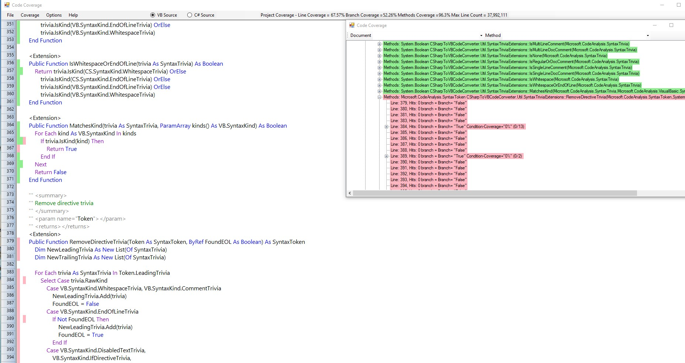

---
languages:
- vb
products:
- dotnet-core
- windows
page_type: VB Code Coverage
name: "Code Coverage (Visual Basic)"
description: "VB Code Coverage"
---
# VB Code Coverage

## Requires

- Visual Studio 2019 version 16.3.0 to compile the code it produces

## License
- MIT

## Technologies
  - Windows Forms

## Topics
- Code Coverage

## Updated
- 02/01/2019

## Description
This application will allow visual analysis of Coverlet JSON files. It creates a tree view of the JSON file which shows coverage for every function. You can filter by Document File then Method.

Hovering over file or method will display information from that point in the tree down.

Clicking on a function will open it up in a another window where coverage is shown in a syntax highlighted file.

https://dotnetfeed.blob.core.windows.net/dotnet-core/index.json is added to NuGet Package Source to find
Microsoft.Dotnet.XUnitExtensions which provides ConditionalFact and PlatformSpecific attributes used for testing.



New in Release 1.0
First public release

## Code Coverage Example Output
```
+------------------+--------+--------+--------+
| Module           | Line   | Branch | Method |
+------------------+--------+--------+--------+
| YourApp          | 79.6%  | 72.37% | 87.91% |
+------------------+--------+--------+--------+

+---------+--------+--------+--------+
|         | Line   | Branch | Method |
+---------+--------+--------+--------+
| Total   | 79.6%  | 72.37% | 87.91% |
+---------+--------+--------+--------+
| Average | 79.6%  | 72.37% | 87.91% |
+---------+--------+--------+--------+
```